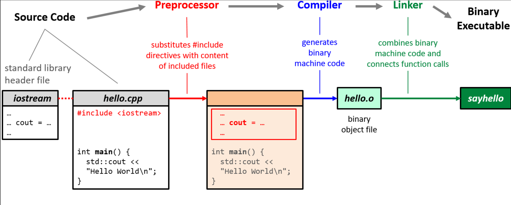

# Hola Mundo en C++


```cpp
#include <iostream>
// our first program
int main ()
{
 std::cout << "Hello World\n";
}
```

## Archivo fuente: `hello.cpp`

```cpp
#include <iostream>
````

Esta línea será reemplazada por el contenido del archivo `iostream`.

`iostream` es un archivo de cabecera que se encuentra en los directorios del compilador y proporciona funcionalidades de entrada y salida.

* `#include "ruta/al/archivo"`
  Inserta el contenido de un archivo específico.

* `#include <archivo>`
  Hace lo mismo, pero busca el archivo en todos los directorios de inclusión estándar.

El preprocesamiento ocurre **antes de la compilación**, por lo que el compilador solo ve el archivo ya preprocesado.

```cpp
// nuestro primer programa
```

Los comentarios son ignorados por el compilador.

```cpp
// comentario de una sola línea
```

```cpp
/* Comentario estilo C
   de múltiples líneas */
```

```cpp
int main ()
```

Define una función llamada `main`.

* Todo programa en C++ comienza ejecutando la función `main`.
* `int` es el único tipo de retorno permitido para `main` (entero).
* `()` es una lista vacía de parámetros.

```cpp
{
```

Los bloques de instrucciones se encierran entre llaves `{ … }`.

* Cada instrucción termina con punto y coma `;`.

```cpp
    std::cout << "Hello World\n";
```

Esta instrucción escribe texto en la consola.

* `std` es el *namespace* de la biblioteca estándar.
* `cout` (abreviatura de *character out*) representa la salida estándar (consola).
* `"Hello World\n"` es un literal de cadena (secuencia de caracteres).
* `\n` es un carácter especial de salto de línea.

```cpp
}
```

El programa termina después de ejecutar la función `main`.

* Si no se especifica un `return`, el programa retorna automáticamente `0`, lo que indica éxito.
* Códigos de retorno distintos de `0` son interpretados como errores por el sistema operativo.

---

## Compilación de `hello.cpp`

C++ es un **lenguaje compilado**:

* El código fuente no puede ejecutarse directamente.
* El código se escribe para una máquina abstracta.
* El compilador traduce el código fuente a código binario entendido por la CPU.
* El resultado es un archivo ejecutable.

```bash
$ g++ hello.cpp -o sayhello     # Compilar y enlazar
$ ./sayhello                    # Ejecutar el archivo `sayhello`
Hello World                    # Salida del programa
```



---

## Terminología

* **Error del compilador**
  El programa no se puede compilar y el compilador se detiene.

* **Advertencia del compilador (Warning)**
  El programa se compila, pero existe código problemático que puede causar errores en tiempo de ejecución.

* **static**
  Fijo en tiempo de compilación (queda integrado en el ejecutable).

* **dynamic**
  Cambiable en tiempo de ejecución (por ejemplo, mediante entrada del usuario).

---

## Banderas del compilador (Compiler Flags)

Banderas recomendadas para tus primeros programas en C++:

```bash
g++ -std=c++20 -Wall -Wextra -Wpedantic -Wshadow input.cpp -o output
```

### Descripción de las banderas

* `-std=c++20`
  Establece el estándar C++20. **Altamente recomendado**.

* `-Wall`

* `-Wextra`

* `-Wpedantic`

* `-Wshadow`

Habilitan advertencias del compilador.
No activan *todas* las advertencias, sino las más importantes sin generar demasiado ruido.

* `-o <nombre>`
  Define el nombre del archivo ejecutable de salida.

> Es 2025: usa C++20 (o al menos C++17 si tu compilador es antiguo).

---

## ❌ No uses `using namespace std;`

Muchos ejemplos muestran algo como:

```cpp
using namespace std;

int main () {
    cout << "bla\n";
}
```

Esto se hace para evitar escribir `std::cout`.

### Pero esto es una mala práctica:

* Importa **todos** los símbolos del namespace `std` al namespace global.
* Puede causar conflictos de nombres y ambigüedades.
* Puede generar errores difíciles de detectar, incluso en tiempo de ejecución.

**Contaminar el namespace global es un problema serio en código de producción.**
Evita este anti-patrón desde el inicio.

---

## Actividad 1 - Hello World en C++

IMPORTANTE
Todas los ejercicios deben realizarse exclusivamente desde la consola (línea de comandos).

### Ejercicio 1 – Modificar la salida

**Objetivo:** entender `std::cout` y las cadenas.

**Indicaciones:**

1. Cambia el texto `"Hello World"` por:

   * Tu nombre
   * El nombre de la carrera
   * El grupo o semestre
2. Imprime **dos líneas distintas** usando `\n`.

**Ejemplo esperado (salida):**

```cpp
Hola, soy Ana
Ingeniería en Telecomunicaciones
```

---

### Ejercicio 2 – Varias instrucciones `cout`

**Objetivo:** entender que un programa es una secuencia de instrucciones.

**Indicaciones:**

* Usa **varias líneas de `std::cout`** en lugar de una sola.

```cpp
std::cout << "Hola\n";
std::cout << "Este es mi primer programa en C++\n";
```

**Pregunta de reflexión:**
¿Qué pasa si quitas el `;`?

---

### Ejercicio 3 – Comentarios (leer vs ejecutar)

**Objetivo:** distinguir código ejecutable de comentarios.

**Indicaciones:**

1. Agrega un comentario explicando qué hace cada línea.
2. Agrega una línea de código comentada y verifica que **no se ejecuta**.

```cpp
// std::cout << "Esto no se imprime\n";
```

---

### Ejercicio 4 – Introducir `return 0`

**Objetivo:** entender cómo termina un programa.

**Indicaciones:**

* Agrega explícitamente `return 0;` al final de `main`.

```cpp
int main ()
{
    std::cout << "Hello World\n";
    return 0;
}
```

**Pregunta:**
¿Cambia algo en la ejecución?

---

### Ejercicio 5 – Error intencional

**Objetivo:** aprender a leer errores del compilador.

**Indicaciones:**

* Provoca un error y compila:

  * Quita una llave `}`
  * Quita `#include <iostream>`
  * Escribe `std::coutt`

Copiar el mensaje de error y explica:

* ¿Qué dice?
* ¿En qué línea ocurrió?

---

### Ejercicio 6 – Pequeño “reto”

**Objetivo:** juntar todo lo visto.

**Reto:**
Imprime algo como esto:

```cpp
=========================
  Mi primer programa C++
  Autor: Juan Pérez
  Año: 2026
=========================
```

---

### Ejercicio 7 – Preguntas

1. ¿Por qué existe la función `main`?
2. ¿Qué pasa si no está `#include <iostream>`?
3. ¿Qué significa `std`?
4. ¿Qué símbolo indica el fin de una instrucción?
5. ¿El compilador ejecuta los comentarios?

---
